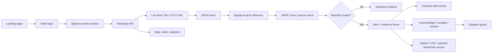

# BorderLens — Border Surveillance Command Center

This repository contains a Django API in `backend/` and a Next.js command-center UI in `frontend/`. The local API stores demo state in `backend/.localdata/`; that directory and all credentials/model weights are intentionally ignored by Git.

## Prerequisites

- Python 3.12 or newer. This project standardizes on Python 3.12+ for its Django environment; `backend/requirements-web.txt` installs Django 5.2.
- Node.js with npm. Install the current LTS from [nodejs.org](https://nodejs.org/en/download).
- A plain local filesystem path. Do not place the project in iCloud Drive Desktop/Documents on macOS or OneDrive Desktop/Documents on Windows. Use `/Users/<your-user>/dev/` or `C:\dev\` instead; cloud sync can cause SQLite's `unable to open database file` error.

The checked-in setup files are `backend/requirements-ai.txt`, `backend/requirements-services.txt`, `backend/requirements-web.txt`, `backend/.env.example`, `frontend/package.json`, `frontend/package-lock.json`, and `frontend/.env.example`.

## macOS setup (zsh or bash)

Install Homebrew from [brew.sh](https://brew.sh/) if it is not already installed, then install Python 3.12 and Node.js:

```bash
brew install python@3.12 node
```

Use Homebrew's Python 3.12 binary explicitly:

```bash
cd ~/dev/border-surveillance-main/backend
PYTHON_BIN="$(brew --prefix python@3.12)/bin/python3.12"
"$PYTHON_BIN" --version
"$PYTHON_BIN" -m venv venv
source venv/bin/activate
python -m pip install --upgrade pip
for requirements_file in requirements-*.txt; do
  python -m pip install -r "$requirements_file"
done
cp .env.example .env
python manage.py check
python manage.py migrate
python manage.py seed_demo
python manage.py runserver 127.0.0.1:8000
```

In a new Terminal window, start the frontend:

```bash
cd ~/dev/border-surveillance-main/frontend
cp .env.example .env.local
npm ci
npm run build
npm run dev
```

Open <http://localhost:3000>. The Django API is available at <http://127.0.0.1:8000/api/health>.

On Apple Silicon, `AI_DEVICE=cuda` or `AI_DEVICE=auto` resolves to CUDA when available, then Apple MPS, then CPU. Use `AI_DEVICE=cpu` when a model does not support MPS.

## Windows setup (PowerShell)

Install Python from [python.org](https://www.python.org/downloads/) or with [WinGet](https://learn.microsoft.com/en-us/windows/package-manager/winget/), and install Node.js with:

```powershell
winget install OpenJS.NodeJS.LTS
```

Keep the project under a plain path such as `C:\dev\border-surveillance-main`, then run:

```powershell
cd C:\dev\border-surveillance-main\backend
py -3.12 --version
py -3.12 -m venv venv
.\venv\Scripts\Activate.ps1
python -m pip install --upgrade pip
Get-ChildItem requirements-*.txt | Sort-Object Name | ForEach-Object { python -m pip install -r $_.FullName }
Copy-Item .env.example .env
python manage.py check
python manage.py migrate
python manage.py seed_demo
python manage.py runserver 127.0.0.1:8000
```

In a new PowerShell window, start the frontend:

```powershell
cd C:\dev\border-surveillance-main\frontend
Copy-Item .env.example .env.local
npm ci
npm run build
npm run dev
```

Open <http://localhost:3000>. If PowerShell blocks activation, run `Set-ExecutionPolicy -Scope CurrentUser RemoteSigned` once and activate again with `.\venv\Scripts\Activate.ps1`.

## Verification commands

From the repository root, the backend test suite can be run without pytest:

```bash
backend/venv/bin/python -m unittest discover -s backend/tests -t . -v
```

The equivalent PowerShell command is:

```powershell
backend\venv\Scripts\python.exe -m unittest discover -s backend\tests -t . -v
```

The production frontend check is `npm run build` from `frontend/`. It performs TypeScript checking, linting, and static page generation.

## Local configuration

Copy the examples before editing values:

- `backend/.env.example` contains Django, CORS, Firebase, blockchain, and AI settings. Keep Firebase credentials and the blockchain signer private key on the backend only.
- `frontend/.env.example` contains only `NEXT_PUBLIC_API_BASE_URL`. The browser should never receive backend secrets.

The local AI endpoint accepts JPEG frames at `POST /api/inference/frame`. Model weights are runtime assets, not repository files. Set `PERSON_MODEL_PATH`, `FACE_MODEL_PATH`, `ANPR_VEHICLE_MODEL_PATH`, and `ANPR_PLATE_MODEL_PATH` to approved local weights when using the inference endpoint. If `FACE_MODEL_PATH` is empty or missing, the local preview uses OpenCV's bundled frontal-face cascade so face boxes still appear; configure an approved YOLO face weight when higher accuracy is required. If `ANPR_PLATE_MODEL_PATH` is missing, ANPR keeps the general vehicle model and runs OCR over detected vehicle regions as a fallback.

The `/live-feed` page has a `VIDEO SOURCE` control with three options:

- `DEVICE CAMERA` requests a camera after the operator clicks enable.
- `VIDEO FILE` accepts a video from the Mac/PC and analyzes it frame by frame in the browser.
- `CCTV / IP URL` accepts a browser-playable `http://` or `https://` video endpoint. The camera must allow browser CORS access when the Django API and camera are on different origins.

Raw `rtsp://`/`rtsps://` addresses cannot be decoded by a normal browser video element. Put an HLS/WebRTC relay such as MediaMTX or go2rtc in front of the camera, then enter the relay's HTTP(S) URL in the live-feed control.

The `/login` page uses rank-based console access. The local demo accounts are:

- `ADMIN-001` / `BL-ADMIN-2026`: administrator access, including guard provisioning.
- `SSB-2041` / `BL-COMMAND-2041`: command access.
- `SSB-2098` / `BL-FIELD-2098`: field access.

After signing in as `ADMIN-001`, open `CAMERA SETTINGS` from the sidebar. The `GUARD REGISTRY // CREDENTIAL PROVISIONING` form creates a guard profile and a hashed login credential in the backend's local state. The new operator ID and passcode can then be used at `/login`; password hashes are never returned in API snapshots. Access is enforced by a signed backend token for guard creation, while the browser route guard controls which console pages each rank can open.

The Border Map uses a custom SVG renderer rather than Leaflet or Mapbox GL. Its `SATELLITE VIEW` toggle places the public Esri World Imagery export underneath the existing camera, alert, guard, sector, and tripwire overlays. This is a periodic/static imagery basemap for geographic context, not a live satellite or surveillance video feed. Esri imagery attribution is shown in the map UI. No API key is required for this demo endpoint.

The live pipeline supports:

- `AI_FACE_FRAME_INTERVAL=3`: run face detection every third pipeline frame.
- `AI_ANPR_FRAME_INTERVAL=5`: run plate detection every fifth pipeline frame.
- `AI_INFERENCE_MAX_DIM=960`: resize only oversized model inputs and scale boxes back to the original frame coordinates. The larger default preserves more detail for small plates.

## Troubleshooting

### Django starts with the wrong Python version

Do not use an older system `python3` or an existing venv created from it. Confirm `python --version` is 3.12+, remove the old `backend/venv` and recreate it with Homebrew's `python@3.12` binary on macOS or `py -3.12` on Windows. Reinstall all three `requirements-*.txt` files.

### `sqlite3.OperationalError: unable to open database file`

The database is `backend/.localdata/django.sqlite3`. The backend now creates `.localdata` during Django startup, but cloud-synced or unusual paths can still interfere with SQLite file locking. Move the project to `/Users/<your-user>/dev/border-surveillance-main` or `C:\dev\border-surveillance-main`, recreate the venv there, and rerun `migrate`.

### `Unknown command: 'seed_demo'`

Run the commands from `backend/` with the project venv active. The repository includes `backend/app/management/commands/seed_demo.py`; `python manage.py seed_demo` resets local JSON state and writes a small deterministic demo dataset.

### `next: command not found`

Run `npm ci` from `frontend/` before `npm run build` or `npm run dev`. Use the repository's `frontend/package-lock.json` so the installed versions match the checked-in dependency graph.

### AI inference returns 503 or cannot load a model

The API does not download model weights. Install `backend/requirements-ai.txt`, configure the person and ANPR model paths in `backend/.env`, and verify the files exist. Face detection falls back to OpenCV when `FACE_MODEL_PATH` is absent; the live-feed module card will identify that fallback. ANPR falls back to OCR over detected vehicle crops when `ANPR_PLATE_MODEL_PATH` is absent, but a dedicated plate detector is more accurate. The live-feed module card identifies which path is active.

### CCTV URL does not play

The browser only accepts video formats and protocols supported by that browser. Try an H.264 MP4 or browser-compatible HLS URL first. RTSP needs an HLS/WebRTC relay, and a remote camera must return the appropriate CORS header; otherwise the preview cannot draw frames for AI analysis.

### `check --deploy` reports security warnings

`python manage.py check` is the local readiness check. `check --deploy` also warns when production-only settings are not configured: clickjacking middleware, HSTS, HTTPS redirects, a strong secret key, and secure CSRF cookies. Configure those in the deployment environment before exposing Django publicly; the local demo intentionally runs over HTTP.

### npm reports audit warnings

The current lockfile builds successfully, but `npm audit` reports a high PostCSS issue and a critical Next.js issue for the pinned Next.js 14.2.15 dependency. Resolving them requires a major Next.js upgrade according to npm, so test that upgrade separately before using this demo in production.

## API and frontend routes

The main backend routes are `/api/health`, `/api/auth/login`, `/api/bootstrap`, `/api/guards`, `/api/alerts`, `/api/activity`, `/api/guards/<id>`, `/api/cameras/<id>`, `/api/shifts/<id>`, `/api/sync`, `/api/reset`, and `/api/inference/frame`.

The frontend pages are `/`, `/login`, `/dashboard`, `/live-feed`, `/alerts`, `/map`, `/analytics`, `/guard-duty`, `/camera-management`, and `/admin`. The `/guard-duty/schedule`, `/guard-duty/activity-log`, `/guard-duty/<guardId>`, `/logistics`, and `/intelligence` routes are present redirect/detail pages, so navigation does not point at missing pages.

## Product scope and boundaries

BorderLens is a border-operations command-center demo. It combines a Django API, a Next.js operator console, local AI inference, an optional Firebase Firestore alert history, and an optional blockchain evidence anchor.

The project is designed to demonstrate an end-to-end workflow with safe synthetic demo data. It is not a certified security product, identity system, or replacement for human review. AI detections are suggestions for an operator to verify. A watchlist match creates an alert, but it does not make an enforcement decision automatically.

The map's satellite layer is a public, static or periodically updated imagery basemap supplied by Esri World Imagery. It is geographic context underneath the BorderLens overlays; it is not a live satellite feed, a live surveillance feed, or continuous video. The live video sources are separate browser video inputs controlled from `/live-feed`.

## What is implemented

- Rank-based login with administrator, command, and field access tiers.
- Server-side signed login tokens for protected administrator and command actions.
- Administrator-only guard provisioning: profile data and a hashed operator passcode are stored together.
- Local device camera, uploaded video file, and browser-playable CCTV/IP URL input modes.
- A clear RTSP limitation and relay path for cameras that expose only `rtsp://`.
- Person tracking, face detection, and ANPR (Automatic Number Plate Recognition) inference through the Django frame endpoint.
- ANPR and face watchlists with duplicate checks, status labels, reasons, and administrator CRUD (Create, Read, Update, Delete) controls.
- Automatic alert creation when a configured ANPR result matches a plate watchlist entry. Face watchlist records are ready for an approved face-identity adapter; a generic face box alone is not treated as a person identity match.
- Alert acknowledgement, escalation, resolution, guard dispatch, CSV export, evidence view, and printable incident report.
- Firestore `alerts` synchronization when Firebase Admin is configured; the local state remains the fallback when Firebase is unavailable.
- Optional SHA-256 evidence hashing and backend-only blockchain anchoring/verification.
- Camera controls, sector map overlays, guard roster, activity log, lockdown/DEFCON controls, and response analytics.
- A theme switcher that defaults to the existing light tactical theme and persists an optional dark mode in the browser.

## Full BorderLens workflow

The normal operator journey is:

1. Open the public landing page at `/`. Review the system status cards and choose the command console.
2. Sign in at `/login` with an operator ID and passcode. The backend validates the credentials, returns a signed session token, and the frontend stores only the session metadata and token in `sessionStorage`.
3. The console layout checks the session tier before showing a protected page. Administrators can open the full registry; command operators can manage operations; field operators start at the live feed and alert views.
4. `BackendHydrator` calls `GET /api/bootstrap`. The API returns guards, shifts, cameras, sectors, alerts, watchlist entries, system state, and safe Firebase/blockchain status. Password hashes are removed from snapshots.
5. Open `/live-feed` and select a source: a local camera, a local video file, or a browser-playable CCTV/IP URL. For a LAN camera, the computer and camera must be reachable on the same network and the camera must provide an HTTP(S), HLS (HTTP Live Streaming), or WebRTC (Web Real-Time Communication) endpoint that the browser can play.
6. When the source is live, the browser samples frames and sends JPEG bytes to `POST /api/inference/frame`. The backend runs the configured local models, returns detections/modules/confidence/device timing, and the UI displays boxes and an AI detection timeline.
7. A returned ANPR plate is normalized and compared with the administrator-managed watchlist. A match is deduplicated for the current source, saved as an alert, and linked to the captured evidence frame when the browser is permitted to export it.
8. Open `/alerts` to review the alert. An operator can acknowledge, escalate, or resolve it. Command/admin users can select a guard and dispatch the alert; the action is written to the activity log and Firebase when configured.
9. Review the alert's evidence, source, timeline details, and chain-of-custody fields. Use `PRINT / SAVE PDF` for a human-readable incident report, `EXPORT CSV` for an operational extract, or the blockchain card to request backend-only hash anchoring.
10. Use `/map` for geographic context and overlays, `/analytics` for response trends, and `/guard-duty` for roster/schedule/accountability. Administrators use `/admin` for camera settings, guard credentials, and watchlist management.



## Page-by-page guide

| Page | Purpose | Main actions | Access |
| --- | --- | --- | --- |
| `/` | Public landing page | View product scope and open the console | Public |
| `/login` | Operator authentication | Enter operator ID/passcode; switch light/dark theme | Public |
| `/dashboard` | Operations overview | Review KPIs, alerts, camera health, guard coverage, demo incident | Admin/command |
| `/live-feed` | Video and AI workspace | Choose device/file/CCTV source, enable camera, analyze frames, inspect timeline | All signed-in tiers |
| `/alerts` | Evidence vault | Search, filter, acknowledge, escalate, resolve, dispatch, export, print reports | All signed-in tiers; dispatch admin/command |
| `/map` | Radar/GIS view | Toggle map/satellite imagery, inspect cameras, alerts, guards, sectors, and tripwires | All signed-in tiers |
| `/analytics` | Response analytics | Review event pulse, severity mix, sector load, response workflow | All signed-in tiers |
| `/guard-duty` | Roster and accountability | Review guard state, call, handover, and schedule links | All signed-in tiers |
| `/guard-duty/schedule` | Shift schedule | Inspect scheduled coverage | Signed-in tiers |
| `/guard-duty/activity-log` | Audit trail | Inspect operator/system actions | Signed-in tiers |
| `/guard-duty/<guardId>` | Guard detail | Review a guard's post, contact, shift, and activity context | Signed-in tiers |
| `/camera-management` | Camera registry | Review camera management navigation and controls | Admin/command as routed |
| `/admin` | Administration | Provision guards, create/delete watchlist rules, toggle camera settings, reset operational cache | Admin only |
| `/logistics`, `/intelligence` | Compatibility routes | Redirect to the relevant console area | Signed-in where required |

## Authentication and access tiers

Authentication has two layers:

1. The browser route guard prevents a signed-in user from opening pages outside their tier.
2. The Django API checks the signed token for sensitive writes such as guard creation, watchlist changes, and guard dispatch. This is the authority that protects those operations; the frontend checks are only for user experience.

| Tier | Typical rank | Capabilities |
| --- | --- | --- |
| Administrator | Administrator | All pages; add guards and credentials; manage watchlists; camera controls; dispatch |
| Command | Inspector / command rank | Dashboard, live feed, alerts, map, analytics, roster; dispatch and incident response |
| Field | Rifleman / field rank | Live feed, alerts, map, analytics, roster; review and action alerts according to the current UI |

The checked-in demo credentials are:

| Operator ID | Passcode | Tier |
| --- | --- | --- |
| `ADMIN-001` | `BL-ADMIN-2026` | Administrator |
| `SSB-2041` | `BL-COMMAND-2041` | Command |
| `SSB-2098` | `BL-FIELD-2098` | Field |

These are demonstration credentials only. Change them before any real deployment. Admin-created guard passcodes are hashed with Django's password hasher before they are stored. They are never returned by `GET /api/bootstrap`.

## Administration workflows

### Add a guard and login

1. Sign in as `ADMIN-001`.
2. Open `CAMERA SETTINGS` / `/admin`.
3. Complete the guard registry form. Name, rank, badge ID, and a passcode of at least six characters are required. If Operator ID is blank, the badge ID is used.
4. Submit the form. The backend creates the guard profile and an `authUsers` record atomically in local state.
5. Give the operator ID and passcode to the guard through an appropriate secure channel. Sign out and test the new login.

### Manage a watchlist

1. From `/admin`, choose `plate` for an ANPR value or `face` for an identity value supported by an approved face adapter.
2. Add a label, status, and reason. Plate values are normalized by removing whitespace and uppercasing.
3. The server rejects duplicate values of the same type.
4. A matching ANPR result creates one deduplicated alert per source/value combination. `Authorized` entries are still logged for audit context; they receive a lower severity than blacklisted or surveillance entries.
5. Delete operator-owned entries from the registry when they are no longer valid. Demo records are only backfilled when the watchlist is empty, so a non-empty operator list is not silently overwritten.

### Reset operational cache

`RESET CACHE` clears operational telemetry such as alerts, activity, guards, cameras, and shifts in the local demo state. It intentionally preserves provisioned authentication records and watchlist entries so an administrator cannot accidentally remove access configuration. Run `seed_demo` only when you intentionally want the deterministic demo dataset restored.

## Video, CCTV, IP, and LAN operation

The browser does not connect a bare LAN cable by itself. A LAN cable only provides network connectivity; the camera still needs an IP address and a browser-readable stream endpoint.

### Local video file

1. Open `/live-feed` and select `VIDEO FILE`.
2. Choose an MP4/H.264, WebM, or another format supported by the browser.
3. The video plays locally in the browser. Frames are sent to Django for inference at the configured cadence; it is not uploaded as a complete file by this demo.
4. Use the detection timeline to jump to a recorded event. Watchlist matches become alerts.

### CCTV over IP or LAN

1. Connect the camera and computer to the same LAN, preferably with a reserved camera IP.
2. In the camera/NVR (Network Video Recorder) settings, enable an H.264 browser-compatible stream. Do not paste camera administrator credentials into the URL.
3. Prefer a browser-readable URL such as `http://CAMERA_IP/path/stream.m3u8` for HLS or a WebRTC playback URL. Enter that URL in `CCTV / IP STREAM`.
4. The camera/NVR must allow the browser origin through CORS (Cross-Origin Resource Sharing) if it is on a different origin. It must also be reachable from the machine running the browser; a cloud deployment cannot directly reach a private `192.168.x.x` address.
5. If the camera exposes only `rtsp://` or `rtsps://`, run a local relay such as MediaMTX or go2rtc, then enter the relay's HTTP(S), HLS, or WebRTC URL. A normal HTML video element cannot decode raw RTSP.

Example conceptual relay flow:

```text
Camera/NVR (RTSP) -> MediaMTX/go2rtc on the LAN -> HLS/WebRTC URL -> BorderLens browser -> Django frame inference
```

The exact relay configuration depends on the camera manufacturer. Use a test stream first, keep the relay inside the trusted network, and protect it with network controls. Browser CORS and codec support are separate from Django CORS: both sides must permit the workflow.

## AI and detection pipeline

The browser captures a frame, but model execution happens in the Django process. `POST /api/inference/frame` receives JPEG bytes and returns a JSON result containing:

- `detections`: label, source module, confidence, bounding box, optional track ID, and module attributes;
- `modules`: active/disabled/unavailable status for person tracking, face detection, and ANPR;
- `model`, `device`, `inferenceMs`, and frame dimensions for operator diagnostics.

The default configuration uses local model paths and does not download weights. The person detector can provide person tracking. Face detection falls back to OpenCV's bundled frontal-face cascade when no approved face model is configured. ANPR can use a vehicle detector plus OCR fallback when a dedicated plate detector is absent, but plate-specific weights generally improve small/angled plate results.

Use `AI_FACE_FRAME_INTERVAL`, `AI_ANPR_FRAME_INTERVAL`, `AI_INFERENCE_MAX_DIM`, and confidence settings in `backend/.env` to balance CPU/GPU load and accuracy. Higher resolution, better lighting, a stable camera angle, and a dedicated plate model usually matter more than repeatedly analyzing the same ten-second clip. A generic face box is not an identity: face watchlist matching requires a detector/adapter that returns a stable identity attribute.

## Firebase alert history

Firebase is an optional backend integration. When all required values are present, the Django Firebase Admin adapter:

1. Initializes Firestore once on the server.
2. Writes each created alert to the collection named by `FIREBASE_ALERTS_COLLECTION` (default: `alerts`) using the alert ID as the document ID.
3. Updates that same document when the alert is acknowledged, escalated, resolved, dispatched, or blockchain-anchored.
4. Reads the collection during bootstrap and merges historical alerts into the local view, so older Firebase alerts can be reviewed in `/alerts`.

If Firebase is not configured, alerts still work in local JSON state and the UI reports Firebase standby. If configuration exists but the Firestore write fails, the API preserves the local record and returns a sync warning so the operator can retry after connectivity/configuration is restored.

Configure Firebase only in `backend/.env`, using either `GOOGLE_APPLICATION_CREDENTIALS` pointing to a local service-account JSON file or all `FIREBASE_*` inline values. Never commit a service-account JSON, private key, or any `NEXT_PUBLIC_*` Firebase Admin value. If a private key has ever been pasted into chat, a repository, or a log, revoke and rotate it in Google Cloud/Firebase before deployment.

## Evidence and blockchain path

Alerts may carry an evidence image, source label, evidence SHA-256 (Secure Hash Algorithm 256-bit) digest, and blockchain status. The raw media is not placed on-chain by this project. The optional blockchain integration runs through Django so RPC (Remote Procedure Call) URLs, contract addresses, and signer private keys never reach the browser.

The operator can request an anchor from the alert dossier. The backend calculates/uses the evidence digest, submits to the configured EvidenceRegistry contract, waits for confirmation, stores the transaction metadata, and then syncs the updated alert to Firebase. With no blockchain configuration, the UI stays in standby and local evidence/reporting still works.

## Satellite map layer

`TacticalSectorMap` is a custom SVG tactical renderer, not Leaflet or Mapbox GL. The `SATELLITE VIEW` control switches the geographic basemap to a public Esri World Imagery tile export while leaving camera markers, alert markers, guard markers, sector polygons, and tripwire overlays above it. The default map view remains available and the theme remains independent of the imagery toggle.

Satellite data is periodic/static imagery and can be hours or days old. It does not show moving people, vehicles, or a live border feed. Attribution is displayed in the map UI. For a production deployment, review the provider's current usage and attribution terms before relying on the public demo endpoint at scale.

## Definitions and full forms

| Term | Full form / meaning |
| --- | --- |
| AI | Artificial Intelligence; software that performs tasks such as detection or classification |
| ANPR | Automatic Number Plate Recognition; detects and reads vehicle registration plates |
| API | Application Programming Interface; the contract used by frontend and backend services |
| CORS | Cross-Origin Resource Sharing; browser rules controlling cross-domain requests |
| CCTV | Closed-Circuit Television; camera/video equipment used for a restricted monitoring network |
| CPU | Central Processing Unit; general-purpose processor |
| CUDA | Compute Unified Device Architecture; NVIDIA GPU acceleration platform |
| CSV | Comma-Separated Values; plain-text tabular export format |
| DEFCON | Defense Readiness Condition; the demo's five-level operational readiness indicator |
| EVM | Ethereum Virtual Machine; runtime used by compatible smart contracts |
| Firebase Admin | Server-side Google Firebase SDK used here to access Firestore without exposing credentials |
| Firestore | Firebase's cloud document database; this project's optional `alerts` history store |
| FPS | Frames Per Second; video frame rate |
| FOV | Field of View; visible camera area |
| GIS | Geographic Information System; mapping and spatial data presentation |
| GPS | Global Positioning System; source of geographic coordinates |
| GPU | Graphics Processing Unit; parallel processor useful for AI inference |
| HLS | HTTP Live Streaming; browser-friendly segmented video protocol |
| HTTP / HTTPS | Hypertext Transfer Protocol / secure HTTP; web transport protocols |
| IP | Internet Protocol; addressing/routing used by network cameras |
| IPFS / CID | InterPlanetary File System / Content Identifier; content-addressed storage concepts referenced by optional evidence tooling |
| JSON | JavaScript Object Notation; API data format |
| LAN | Local Area Network; a local wired or wireless network |
| MPS | Metal Performance Shaders; Apple GPU acceleration path used by PyTorch on macOS when supported |
| NVR | Network Video Recorder; device that aggregates and serves IP camera streams |
| OCR | Optical Character Recognition; converts text in an image into characters |
| PDF | Portable Document Format; printable incident report format |
| POI | Point of Interest; a notable map location |
| PTZ | Pan-Tilt-Zoom; remotely controllable camera movement |
| QRF | Quick Reaction Force; response unit label used in the demo workflow |
| RBAC | Role-Based Access Control; permissions derived from rank/tier |
| REST | Representational State Transfer; the resource-oriented HTTP style used by the API |
| RTSP / RTSPS | Real Time Streaming Protocol / secure RTSP; common camera protocols that require a browser relay here |
| SHA-256 | Secure Hash Algorithm with a 256-bit digest; integrity fingerprint for evidence |
| UI / UX | User Interface / User Experience |
| WebRTC | Web Real-Time Communication; low-latency browser media transport |
| YOLO | You Only Look Once; real-time object-detection model family supported by the local inference service |

## API reference

All routes are served below the backend host, for example `http://127.0.0.1:8000/api/health`.

| Method | Route | Purpose |
| --- | --- | --- |
| GET | `/api/health` | Backend health check |
| POST | `/api/auth/login` | Validate operator credentials and return a signed token |
| GET | `/api/bootstrap` | Return operational snapshot plus Firebase/blockchain status |
| GET/POST | `/api/watchlist` | Read entries; administrator creates an entry |
| DELETE | `/api/watchlist/<entryId>` | Administrator deletes an entry |
| POST | `/api/inference/frame` | Run selected AI modules on a JPEG frame |
| GET/POST | `/api/alerts` | Read merged alert history; create and sync an alert |
| POST | `/api/alerts/<alertId>/action` | Acknowledge, escalate, or resolve an alert |
| POST | `/api/alerts/<alertId>/dispatch` | Admin/command assigns a guard |
| POST | `/api/alerts/<alertId>/anchor` | Request optional blockchain anchoring |
| GET | `/api/alerts/<alertId>/verification` | Verify an alert's evidence anchor |
| GET/POST | `/api/activity` | Read or record audit activity |
| GET/POST | `/api/guards` | Read guards; administrator creates guard + credentials |
| GET/PATCH | `/api/guards/<guardId>` | Read/update guard detail |
| PATCH | `/api/cameras/<cameraId>` | Update camera configuration |
| PATCH | `/api/shifts/<shiftId>` | Update shift assignment |
| POST | `/api/handover` | Record a guard handover |
| POST | `/api/system/action` | Change DEFCON or lockdown state |
| POST | `/api/sync` | Upload queued local alerts/activity after reconnect |
| POST | `/api/reset` | Reset operational demo state while preserving auth/watchlist config |
| GET | `/api/firebase/status` | Safe Firebase configuration/initialization status |
| GET | `/api/blockchain/status` | Safe blockchain configuration/connection status |

## Project structure

```text
border-surveillance-main/
├── backend/
│   ├── app/api/                 # HTTP views, local repository, API adapters
│   ├── app/services/inference/  # frame decoding, models, OCR/tracking adapters
│   ├── app/services/evidence/   # Firebase/Firestore and evidence helpers
│   ├── app/services/blockchain/ # optional contract/RPC clients and workers
│   ├── app/management/commands/ # seed_demo command
│   ├── config/                  # Django settings and URLs
│   ├── requirements-*.txt      # web, AI, and optional service dependencies
│   ├── .env.example             # safe configuration template
│   └── .localdata/              # ignored local state, database, and model files
├── frontend/
│   ├── app/                     # Next.js routes and page layouts
│   ├── components/              # console, map, video, evidence, and shared UI
│   ├── lib/api/                 # typed backend client
│   ├── lib/store/               # Zustand operational state and sync actions
│   ├── lib/auth.ts              # session and route-tier rules
│   └── .env.example             # public API URL only
└── README.md
```

## Security and privacy checklist

- Do not commit `backend/.env`, service-account JSON, private keys, model weights, `.localdata`, or browser secrets.
- Keep Firebase Admin and blockchain signer values in the backend environment/secret manager only.
- Do not expose private camera credentials in a stream URL, frontend environment variable, screenshot, or issue.
- Restrict CCTV relays to the trusted LAN and use authentication/network controls.
- Use HTTPS, secure cookies/tokens, a strong production secret, restrictive CORS/CSRF settings, and real identity management before public deployment.
- Review every AI alert with a trained human. Do not use the demo's synthetic credentials or sample watchlist records as real operational data.

## Contributing locally

Work on the checked-out `main` branch if that is the repository policy, run the backend tests and `npm run build`, inspect `git diff --check`, and keep secrets out of the commit. A basic contribution sequence is:

```bash
git status
git add backend frontend README.md
git commit -m "Describe the BorderLens change"
git push origin main
```

If you are contributing to a repository you do not own, use its normal fork/pull-request process. Do not force-push `main` or commit generated credentials.
